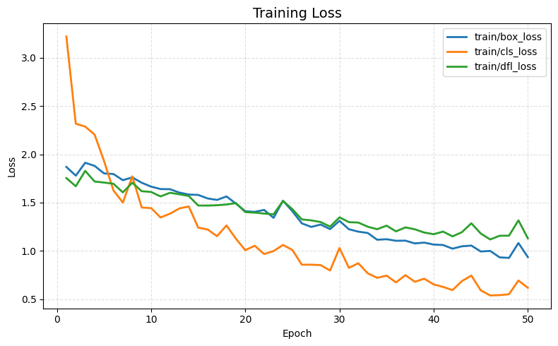
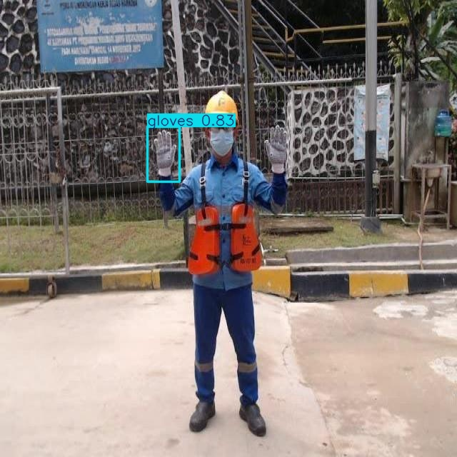
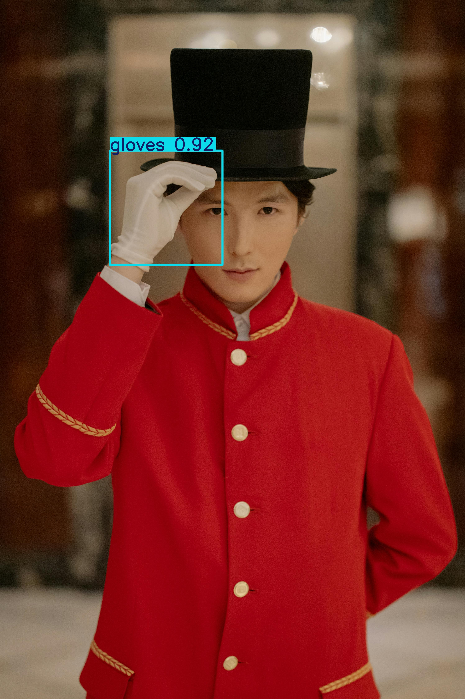

# 🧤 Glove Detection Project


- Labels **Gloved Hand** and **Bare Hand**
- Dataset: https://app.roboflow.com/rahul-mlibg/gloves-abivo-4wnuk/browse?queryText=&pageSize=50&startingIndex=0&browseQuery=true
- Model: YOLOv8 Pre-trained

---

## Project Structure

```text
Glove_det_Project/
│
├── dataset/
│   ├── train/
│   │   ├── images/
│   │   └── labels/
│   ├── valid/
│   │   ├── images/
│   │   └── labels/
│   └── test/
│       ├── images/
│       └── labels/
│
├── runs/
│   └── ppe_glove/
│       ├── weights/
│       │   ├── best.pt
│       │   └── last.pt
│       └── training_plots/
│
├── inference/
│   ├── input/
│   └── output/
│       ├── detection_logs.json
│       └── annotated_images/
│
├── validation.ipynb
├── training.ipynb
├── evaluation.ipynb
├── inference.ipynb
├── requirements.txt
└── README.md
```

---

## Dataset

Roboflow - Yolo v8 fromate


---

## Dataset Validation

Validation checks performed before training:

- Image count
- Missing labels
- Missing images
- Empty label files
- Corrupt images
- Class distribution

---

## Training Params
- **Image Size:** 640 × 640
- **Optimizer:** AdamW
- **Epochs:** 50
- **Device:** Google Collab T4 GPU
---

## Evaluation

Evaluation includes:

- Precision
- Recall
- mAP@50
- mAP@50-95
- Confusion Matrix
- Precision-Recall Curve

## Sample Results

<table>
<tr>
<td></td>
<td></td>
<td></td>
</tr>

<tr>
<td></td>
<td></td>
</tr>
</table>

---

## Inference

The inference notebook:

- annotated images
-  JSON format

Example JSON:

```json
[
    {
        "image": "image1.jpg",
        "detections": [
            {
                "class": "gloved_hand",
                "confidence": 0.98,
                "bbox": [121.5,84.2,244.8,210.3]
            }
        ]
    }
]
```

---

# Sample Results

### Example 1



---

### Example 2



---

### Example 3


---
## Running Inference

Follow the steps below to perform inference on custom images:

### Step 1: Add Input Images

Copy or upload all `.jpg` images to the following directory:

```text
Glove_det_Project/
└── inference/
    └── input/
```
### Step 2: Run the Script
```text
ROOT/inference.ipynb
```
### Step 3: Get the outputs in
```text
Glove_det_Project/
└── inference/
    └── output/
```


